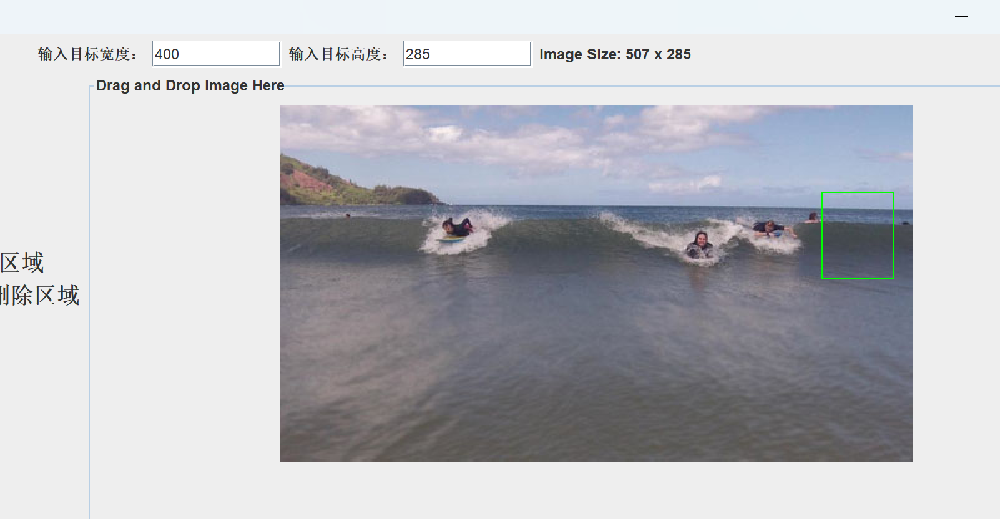
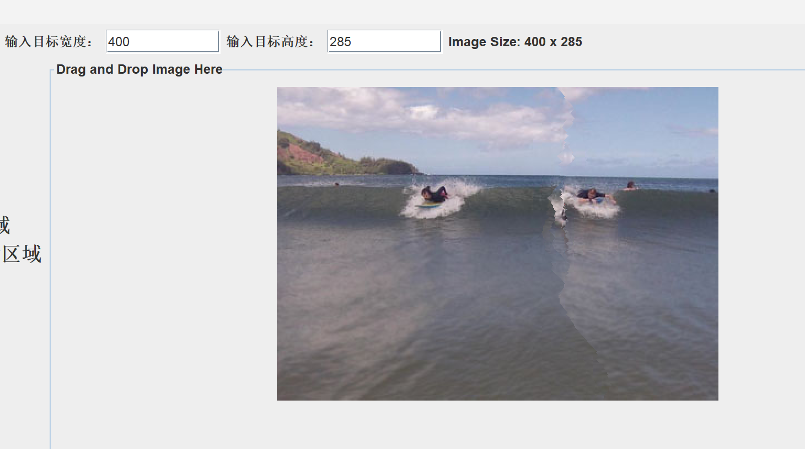

# CS203B Project Report
小组成员：陈锦源 徐锦焜 林必同
## 一、程序设计思路与分工
由于本次项目给出了用于实现目标的基本算法，在经过小组成员讨论后，决定按照一下顺序完成程序的设计：

1.实现给定图片梯度图的计算。  
2.根据Seam-Carving算法的基本思路完成找出并删去Seam的方法。  
3.搭建GUI，完成程序缩小图片的基本功能。  
4.基于已经完成的方法，添加放大图片的功能。  
5.实现区域选取，使选取的区域在Seam的删除过程中优先被删除或被保留。  

在项目开展过程中，徐锦焜同学负责前端GUI的搭建，陈锦源和林必同同学负责后端算法的实现。
## 二、程序已实现的功能
### 1）程序界面设计  
在main方法运行程序后，用户即可看到该界面： 

  

用户界面最上方为图片目标宽度和高度的输入窗口以及图片现有尺寸。中间左侧为程序使用方法的大致说明。中间右侧为图片的显示界面，用户可以直接将图片拖拽入这个区域并利用用户界面最下方的按钮调用后端的方法对图片进行处理。

将图片直接拖入界面后的用户界面如下：  

  

可以看到：图片成功地被展示在程序界面中，并且它此时的宽和高也已经被显示在上方的标签中。
### 2）具体功能展示
#### i）使用Load按钮载入图片
除了上述的直接用鼠标将图片拖入程序，我们还设计了Load按钮来载入图片。当用户点击Load按钮后，程序会弹出窗口用于浏览本地的文件夹并选取图片文件：

此时用户可以继续浏览选择图片，也可以点击取消退出浏览。若用户完成了图片选择，即可得到与直接拖入图片相同的结果：

 

此时如果想载入新的图片进行处理，我们可以直接再次用Load按钮再次选择图片或直接将图片拖入，而无需重启程序。

#### ii）使用Carve按钮裁剪图片

在成功载入图片后，用户可以在程序界面上方输入目标宽度和高度，随后点击Carve按钮即可完成裁剪。例如，用户输入400的目标宽度和250的目标高度并点击Carve按钮后，即可得到：

提示弹窗的显示代表图像已经处理成功，对于尺寸较大的图片这可能需要一段时间。可以看到此时图片已经被成功缩小，上方的尺寸标签也已经被更新为图片的现有宽度和高度。

我们在Carve按钮上添加了报错功能，如果输入的目标宽度大于现有宽度或目标高度大于现有高度，点击Carve按钮则会弹出报错窗口。例如，用户若在刚刚裁剪得到的缩小版图片中输入它被裁剪之前的尺寸——宽507，高285，可以得到：

再关闭弹窗并输入合规的尺寸后，用户可以在已有的成果图片上继续裁剪：

此时图片已经被裁剪至300*200的大小

#### iii）使用Expand按钮放大图片

除了裁剪之外，我们还实现了放大图片的功能。用户可以输入比图片现有宽和高更大的目标尺寸，并点击放大来放大图片。例如，用户可将刚刚裁剪过的图片放大至500\*400：

可以看到，图像已经被成功放大。

我们同样地为图片放大添加了报错的功能，如果输入的目标尺寸小于现有尺寸，在点击Expand按钮后会出现：

此时用户也可以更改目标宽度或高度继续放大，例如将图片放大至500\*500：

#### iv）集成了缩放功能的Process按钮

除了可以分别实现裁剪图片和放大图片的Carve按钮与Expand按钮外，我们还添加了Process按钮及其对应方法使某方向的缩小和另一方向的放大得以同时进行。

例如，用户可以输入400\*350的目标尺寸，并点击Process按钮对初始的507\*285的图片进行处理.随后可得到如下结果：

#### v）使用Select To Protect按钮来保护部分区域

我们设计了Select To Protect按钮来保护部分区域不被删去。当用户点击该按钮后，会显示该模式的使用说明弹窗：

此时用户即可在图片上拖出矩形图案来框选区域：

此时用户若想取消选取需要点击按钮退出选取模式，随后再次点击按钮重新进入选取模式：

在关闭弹窗后，用户先前拖出的矩形会被去除。当用户再次进入选取模式而未选取区域直接进行裁剪时，会提示用户进行选取或退出选取模式：

在用户正确选取区域并输入目标宽度和高度后，即可进行裁剪：

与直接裁剪至400*285的尺寸相比，可以看出图片右侧的选中区域被保留了，下图为直接裁剪的结果：

此后用户可以继续选择保护区域进行裁剪，也可以退出并进行其他操作。同时，用户若在未退出选取模式时直接载入新的图片，则会仍然在选取模式之内。

#### vi）使用Select To Delete按钮来优先删除区域

该按钮的使用方法与Select To Protect相同。在区域选取中，我们选择用红色矩形来框选将会被优先删除的区域：

此时用户再输入目标宽度和高度并点击Carve按钮，即可得到：

我们可以明显看出选中的人物被优先删去了。

#### vii）使用Save按钮保存缩放结果

在完成对图片的缩放编辑后，用户可以点击Save按钮保存结果。在点击Save按钮后，程序会弹出窗口用于浏览本地的文件夹：

编辑完成的图片会被自动命名为“example”的jpg格式图片，用户也可以自行修改文件名与后缀。在上述界面点击取消后即可退出。

也可以选择将图片保存至桌面：

此时用户若再次点击Save按钮并选择了desktop文件夹进行保存，会弹出报错弹窗：

在修改文件名后即可再次顺利保存：

## 三、后端算法介绍
### 1）计算梯度图
文档中给出了计算梯度的方法，即用当前像素的后一个像素的值与前一个像素的值相减，但这样的计算方法过于简单，所以最终计算结果不准确。我们在project中使用了sobel算子边缘检测算法计算梯度，
公式如图所示：

将求得的R、G、B三色的x、y方向梯度的平方和的平方根作为该像素的能量。

### 2）Seam的选择与删去

seam定义为像素从上到下(或从左到右)的连接路径。对于从上到下的像素，我们将从每一行中选取一个像素。这些连接的路径就组成了一条seam。对一张200x300的图片，
如果删除了横向的一条seam，就可以得到一张200x299的新图片。同理，竖着删除一条seam，就可以得到199x300的新图片。所以删除一些seam就可以达到缩放图片的效果。
能量定义了一个像素在图像中的重要程度。为了保留图像中的主要内容，我们删除图像中图像中总能量较低的seam，这样就保留了图像中的主要内容。

我们知道对于从上到下的seam。如果一个像素的横坐标为x，那么上一行组成seam的像素的横坐标只能是x-1,x,x+1。那么我们为了让能量最小，我们能选择上一行这三个像素中能量最小的像素和该像素组成seam，那么通过该点时的总能量为这一点的能量加上上一行像素总能量的最小值。所以可以利用以下递推公式(从上到下)计算代价：

M(i,j)=E(i,j)+min(M(i−1,j−1),M(i−1,j),M(i−1,j+1))

参考以下图示：

由于计算的最后一行时，为经过最后一行像素的seam的最小总能量。那么我们只要挑选总能量最小的像素，并进行回溯，找到这个最小能量对应的seam即可。计算代价的函数如下：

    private static int[][] computeHorizontalCumulativeEnergyMap(int[][] energyMap) {
        int rows = energyMap.length;
        int cols = energyMap[0].length;
        int[][] cumulativeEnergyMap = new int[rows][cols];
        // 复制第一行
        System.arraycopy(energyMap[0], 0, cumulativeEnergyMap[0], 0, cols);

        // 计算每个位置的累积能量值
        for (int i = 1; i < rows; i++) {
            for (int j = 0; j < cols; j++) {
                int minEnergy = Integer.MAX_VALUE;

                // 限制索引范围，避免数组越界
                int prevRow = i - 1;
                int prevCol = Math.max(j - 1, 0);
                int nextCol = Math.min(j + 1, cols - 1);

                // 查找上一行相邻列的最小累积能量值
                minEnergy = Math.min(minEnergy, cumulativeEnergyMap[prevRow][prevCol]);
                minEnergy = Math.min(minEnergy, cumulativeEnergyMap[prevRow][j]);
                minEnergy = Math.min(minEnergy, cumulativeEnergyMap[prevRow][nextCol]);

                // 计算当前位置的累积能量值
                cumulativeEnergyMap[i][j] = energyMap[i][j] + minEnergy;
            }
        }

        return cumulativeEnergyMap;
    }

回溯路径的函数如下：

    private static int[] findHorizontalSeam(int[][] cumulativeEnergyMap) {
        int rows = cumulativeEnergyMap.length;
        int cols = cumulativeEnergyMap[0].length;

        // 找到最后一行中累积能量最小的列作为起点
        int minEnergyCol = 0;
        int minEnergy = cumulativeEnergyMap[rows - 1][0];
        for (int j = 1; j < cols; j++) {
            if (cumulativeEnergyMap[rows - 1][j] < minEnergy) {
                minEnergy = cumulativeEnergyMap[rows - 1][j];
                minEnergyCol = j;
            }
        }

        int[] minEnergyPath = new int[rows];
        minEnergyPath[rows - 1] = minEnergyCol;

        // 从倒数第二行开始，逐行向上寻找累积能量最小的邻居列
        for (int i = rows - 2; i >= 0; i--) {
            int currentCol = minEnergyPath[i + 1];
            int prevCol = currentCol;
            int nextCol = currentCol;

            // 限制索引范围，避免数组越界
            if (currentCol > 0) {
                prevCol = currentCol - 1;
            }
            if (currentCol < cols - 1) {
                nextCol = currentCol + 1;
            }

            // 选择累积能量最小的邻居列
            if (cumulativeEnergyMap[i][prevCol] <= cumulativeEnergyMap[i][currentCol]
                    && cumulativeEnergyMap[i][prevCol] <= cumulativeEnergyMap[i][nextCol]) {
                minEnergyPath[i] = prevCol;
            } else if (cumulativeEnergyMap[i][nextCol] <= cumulativeEnergyMap[i][currentCol]
                    && cumulativeEnergyMap[i][nextCol] <= cumulativeEnergyMap[i][prevCol]) {
                minEnergyPath[i] = nextCol;
            } else {
                minEnergyPath[i] = currentCol;
            }
        }

        return minEnergyPath;
    }
最后在图片中移除这条seam即可完成水平的缩放。竖直方向的缩放同理。

为了减少时间复杂度，我们尝试了在删去图片中的seam的同时，删去能量图的相应seam，这样可以有效减少每次计算能量图的时间。

我们还创新地运用了一次寻找多条不重叠的seam的方法，即设定一个二维布尔型数组，对应图片中的每个像素点，在每寻找一条seam之后，
将这条seam中的每个点标为true，在回溯下一条seam时，如果遇到标记为true的点则跳过该点。我们尝试了计算一次累计图寻找并删去3条seam，准确程度与最初的方法相当，但大大减少了时间复杂度。

如下分别为目标大小为507*100的每次删去seam后重新计算能量图、同时删去原图和能量图的seam、一次在原图和能量图中删去多条seam的处理结果：

经过权衡，我们最终选择了结果最准确、耗时最长的第一种方法，但其他方法仍保留在注释的代码中。
### 3）放大图片

实现放大图片功能的主要思路为选取图片能量最小的seam，将其复制一次，可使图片的长度或宽度增加1。
但是如果想要实现任意数量的增加和减少则很难成功，因为每次调用findHorizontalSeam()方法算得的seam永远相同，按照这样扩充的话会导致图片比例失衡。
因此我们选择一次计算多条不交叉的能量最短路径，将其按照坐标由高到低依次复制一次。
因此我们的图片放大算法至多在原图大小的基础上放大一倍。

下面分别为样例图片分别进行目标大小为 507 * 400 和 700 * 285 放大的结果：

### 4）选取区域的保护与优先删除

选择需要删除的seam的原理是通过计算能量累计，再回溯得到能量最短的路径，那么我们只需要将选中的优先删除的区域中像素点的能量设置为较低值，
再进行正常的删除流程，即可实现区域优先删除，在我们的project中，我们将选中像素的能量设置为-100000000。

如图为优先删除区域以及删除至 500 * 200 的结果：

## 四、总结

在该项目中，我们小组在参考了相关资料后合作设计了基于Seam-Carving的图片缩放程序，完成了以下功能：

1.缩小图片至指定尺寸

2.放大图片至指定尺寸

3.搭建了GUI界面

4.选择区域以优先删除或加以保护

但同时还有以下由于时间原因未能完善的待改进之处：

1.找出并删除Seam的算法时间复杂度较高，导致处理原尺寸较大的图片时运行速度过慢。

2.选取区域后的保护和删除准确性有待提高，仅可选取矩形区域也有局限性。

3.GUI界面还有较大美化空间

## 以上便是我们小组报告的全部内容，感谢阅读。

