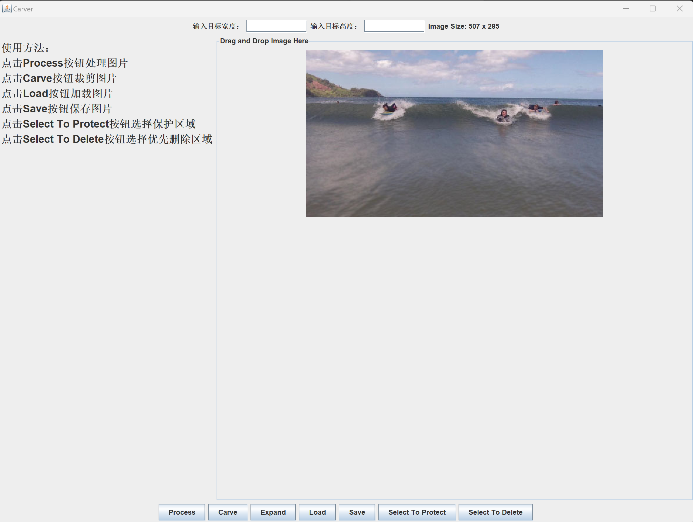
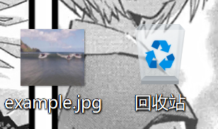

# CS203B Project Report
小组成员：陈锦源 徐锦焜 林必同
## 一、程序设计思路与分工
由于本次项目给出了用于实现目标的基本算法，在经过小组成员讨论后，决定按照一下顺序完成程序的设计：
1.实现给定图片梯度图的计算。  
2.根据Seam-Carving算法的基本思路完成找出并删去Seam的方法。  
3.搭建GUI，完成程序缩小图片的基本功能。  
4.基于已经完成的方法，添加放大图片的功能。  
5.实现区域选取，使选取的区域在Seam的删除过程中优先被删除或被保留。  

在项目开展过程中，徐锦焜同学负责前端GUI的搭建，陈锦源和林必同同学负责后端算法的实现。
## 二、程序已实现的功能
### 1）程序界面设计  
在main方法运行程序后，用户即可看到该界面： 

  

用户界面最上方为图片目标宽度和高度的输入窗口以及图片现有尺寸。中间左侧为程序使用方法的大致说明。中间右侧为图片的显示界面，用户可以直接将图片拖拽入这个区域并利用用户界面最下方的按钮调用后端的方法对图片进行处理。

将图片直接拖入界面后的用户界面如下：  

  

可以看到：图片成功地被展示在程序界面中，并且它此时的宽和高也已经被显示在上方的标签中。
### 2）具体功能展示
#### i）使用Load按钮载入图片
除了上述的直接用鼠标将图片拖入程序，我们还设计了Load按钮来载入图片。当用户点击Load按钮后，程序会弹出窗口用于浏览本地的文件夹并选取图片文件：

此时用户可以继续浏览选择图片，也可以点击取消退出浏览。若用户完成了图片选择，即可得到与直接拖入图片相同的结果：

 

此时如果想载入新的图片进行处理，我们可以直接再次用Load按钮再次选择图片或直接将图片拖入，而无需重启程序。

#### ii）使用Carve按钮裁剪图片

在成功载入图片后，用户可以在程序界面上方输入目标宽度和高度，随后点击Carve按钮即可完成裁剪。例如，用户输入400的目标宽度和250的目标高度并点击Carve按钮后，即可得到：

提示弹窗的显示代表图像已经处理成功，对于尺寸较大的图片这可能需要一段时间。可以看到此时图片已经被成功缩小，上方的尺寸标签也已经被更新为图片的现有宽度和高度。

我们在Carve按钮上添加了报错功能，如果输入的目标宽度大于现有宽度或目标高度大于现有高度，点击Carve按钮则会弹出报错窗口。例如，用户若在刚刚裁剪得到的缩小版图片中输入它被裁剪之前的尺寸——宽507，高285，可以得到：

再关闭弹窗并输入合规的尺寸后，用户可以在已有的成果图片上继续裁剪：

此时图片已经被裁剪至300*200的大小

#### iii）使用Expand按钮放大图片

除了裁剪之外，我们还实现了放大图片的功能。用户可以输入比图片现有宽和高更大的目标尺寸，并点击放大来放大图片。例如，用户可将刚刚裁剪过的图片放大至500\*400：

可以看到，图像已经被成功放大。

我们同样地为图片放大添加了报错的功能，如果输入的目标尺寸小雨现有尺寸，在点击Expand按钮后会出现：

此时用户也可以更改目标宽度或高度继续放大，例如将图片放大至500\*500：

#### iv）集成了缩放功能的Process按钮

除了可以分别实现裁剪图片和放大图片的Carve按钮与Expand按钮外，我们还添加了Process按钮及其对应方法使某方向的缩小和另一方向的放大得以同时进行。

例如，用户可以输入400\*350的目标尺寸，并点击Process按钮对初始的507\*285的图片进行处理.随后可得到如下结果：

#### v）使用Save按钮保存缩放结果

在完成对图片的缩放编辑后，用户可以点击Save按钮保存结果。在点击Save按钮后，程序会弹出窗口用于浏览本地的文件夹：

编辑完成的图片会被自动命名为“example”的jpg格式图片，用户也可以自行修改文件名与后缀。在上述界面点击取消后即可退出。

也可以选择将图片保存至桌面：

此时用户若再次点击Save按钮并选择了desktop文件夹进行保存，会弹出报错弹窗：

在修改文件名后即可再次顺利保存：

## 三、后端算法介绍
### 1）计算梯度图
### 2）Seam的选择与删去
### 3）放大图片

